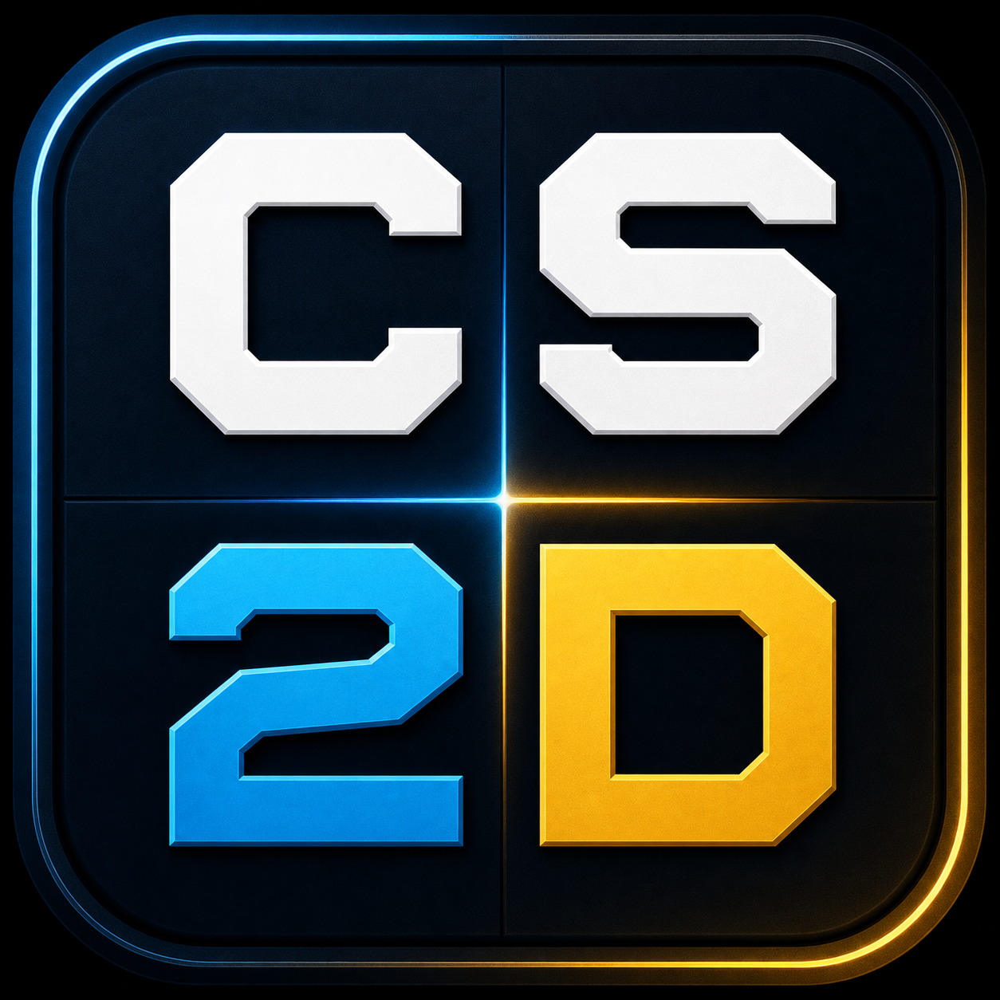

# CS2D Viewer

<p align="center">
  
</p>

<p align="center">
  A focused Windows desktop viewer for Counter-Strike 2 demo files — tactical 2D playback, event audio, and match-local statistics in one portable app.
</p>

<p align="center">
  <a href="https://github.com/vexmach1ne/CS2D-Viewer/releases/latest"><strong>Download for Windows</strong></a> ·
  <a href="https://github.com/vexmach1ne/CS2D-Viewer/releases">All releases</a> &middot;
  <a href="https://ko-fi.com/vex_games">Support development</a>
</p>

## What it does

CS2D Viewer opens a local CS2 `.dem` file and turns it into a responsive tactical replay. It is designed for reviewing one match at a time: follow players, inspect utility and bomb events, pause and seek through rounds, and review current or full-match player and team statistics.

- 2D tactical-map playback with free camera, player follow, pan, zoom, and round navigation
- Player positions, direction, names, health, active-weapon icons, trails, and side-coloured tracers
- Utility effects, projectile paths, planted-bomb location, kill feed, scoreboard, round clock, and score
- Map support for Ancient, Anubis, Dust2, Inferno, Mirage, Nuke, and Overpass, plus a usable grid fallback
- Original synthesized event audio with viewport-relative stereo panning for weapons, utility, bomb events, damage, doors, and round results
- General, Performance, and Utility statistics for the current playback tick or full match
- Restore the most recently opened demo and its playback position between launches

## Download and run

1. Download the latest `CS2D-Viewer-*-portable.exe` from the [Releases page](https://github.com/vexmach1ne/CS2D-Viewer/releases).
2. Run the EXE. No installer is required.
3. Select **Open demo** and choose a local CS2 `.dem` file.

The first public builds are unsigned, so Windows may show a SmartScreen warning. Only run files downloaded from this repository's official [Releases page](https://github.com/vexmach1ne/CS2D-Viewer/releases).

## Controls

| Action | Control |
| --- | --- |
| Play / pause | `Space` |
| Seek | Timeline or tick input |
| Skip five seconds | `Left` / `Right` |
| Previous / next round | `Shift` + `Left` / `Right` |
| Show scoreboard | Hold `Tab` |
| Show active weapon icons | Hold `Alt` |
| Pan camera | Right-drag |
| Recenter camera | Double right-click |
| Zoom | Mouse wheel — zoom-in anchors at the cursor; zoom-out anchors at the viewport centre |

## Statistics

CS2D Viewer calculates statistics from the active demo only. Switch between:

- **Current** — values accumulated through the currently selected tick.
- **Full Match** — values evaluated at the end of the demo.

Metrics include enemy kills, deaths, direct and flash assists, firearm shots, damage and ADR, survival, utility usage, blinds, plants, defuses, and team score. Suicides and team kills are retained as deaths but excluded from enemy-kill totals.

## Privacy and local data

The app does not upload demos or maintain a cross-match database. It stores only local viewer state under `%LOCALAPPDATA%\CS2DemoViewer`:

- `session.json` — last opened demo and playback state
- `preferences.json` — visual, audio, and map-layout settings
- `cache/<fingerprint>.viewer.json` — one active parsed demo cache

Your original `.dem` file is never modified or copied. If the original file is later unavailable, the cached match remains viewable in read-only mode.

## Requirements

- Windows 10 or Windows 11, x64
- A Counter-Strike 2 `.dem` file

## Known limitations

- Windows x64 is the only supported release target.
- The app is focused on active-demo review; historical libraries, player profiles, cross-demo analytics, coaching tabs, and cloud sync are intentionally out of scope.
- Unknown maps use the grid fallback until dedicated overview art is added.
- Very new demos or parser-incomplete event tracks may show a visible warning rather than silently omit data.

## Development

Requires Node.js 22 or newer.

```powershell
npm install
npm run dev
```

Validate and package:

```powershell
npm run typecheck
npm run lint
npm test
npm run package:win
```

`npm run package:win` produces the unsigned Windows portable executable in `release/`.

## Credits and notices

See [THIRD_PARTY_NOTICES.md](THIRD_PARTY_NOTICES.md) for third-party components and asset provenance. Counter-Strike and CS2 are trademarks of Valve Corporation. This project is not affiliated with or endorsed by Valve.
